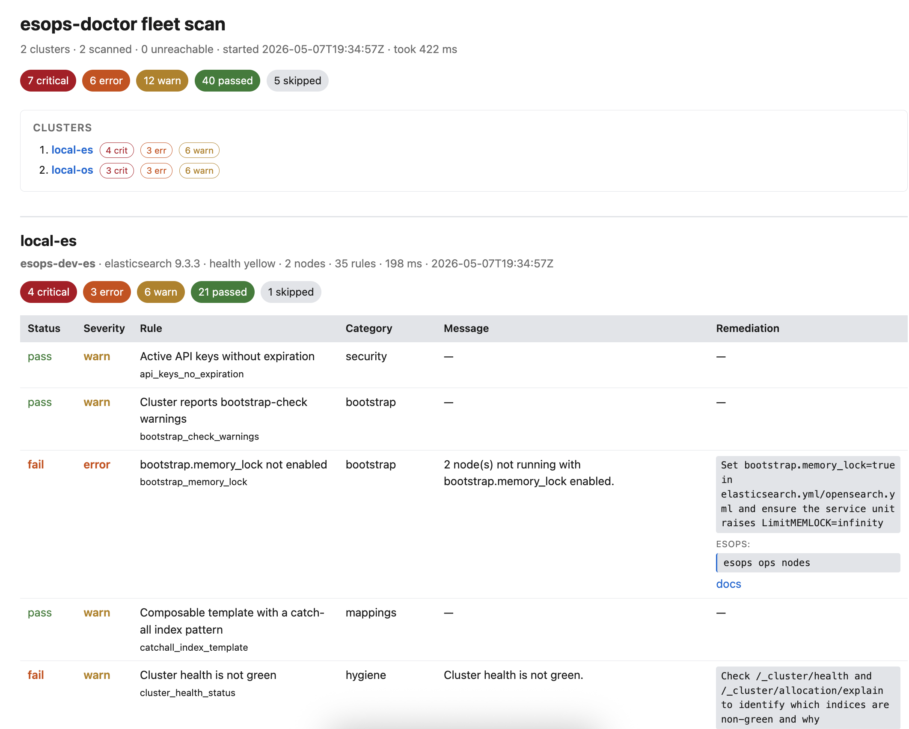

# esops-doctor

Read-only diagnostic linter for self-hosted Elasticsearch and OpenSearch clusters. Think `kube-bench` / `kube-score` but for ES/OS: *"Tell me what's wrong."*

[](https://github.com/esops-dev/esops-doctor/actions/workflows/ci.yml)
[](https://github.com/esops-dev/esops-doctor/releases)
[](LICENSE)

`esops-doctor` is the diagnostic counterpart to [`esops`](https://github.com/esops-dev/esops-go), `esops` is imperative and may mutate, `esops-doctor` is declarative, opinionated and **never mutates**.

**esops-doctor** gives you:
- Read-only diagnostic scans for Elasticsearch & OpenSearch
- 100% declarative rules written in CEL (no Go code needed)
- Multiple output formats (table, SARIF, HTML, JUnit…)
- Built-in profiles for prod/staging/dev/CI/CIS-bench
- Zero telemetry — completely private by design

## Read-only by design

The client is read-only by design. This restriction is enforced through static analysis of the import graph rather than through manual code review processes.
If the CI pipeline detects any internal dependency that references a mutating API within esops-go/pkg/client or that directly imports the Elasticsearch/OpenSearch client we manage, the build will fail.

## Installation

Pre-built binary files are available for download with every
[GitHub release](https://github.com/esops-dev/esops-doctor/releases):

- Archive files for `linux/amd64`, `linux/arm64`, `darwin/amd64`, `darwin/arm64`, and `windows/amd64`.
- Debian (.deb) and RPM packages for Linux.
- Digital signatures and SBOM files (CycloneDX & SPDX) along with the binary.

Extract the downloaded file and move `esops-doctor` somewhere on your `$PATH`.

## Configuring a context

`esops-doctor` reuses the `esops` config file (`~/.config/esops/config.yaml`, or `$ESOPS_CONFIG`) and its `contexts` map. If you have `esops` configured, you have `esops-doctor` configured.

A minimal config:

```yaml
current-context: prod
contexts:
  prod:
    url: https://prod-es.example.internal:9200
    auth:
      type: basic
      username: doctor
      password: ${env:ES_DOCTOR_PASSWORD}
    tls:
      ca_cert: /etc/ssl/certs/internal-ca.pem
  staging:
    url: https://staging-es.example.internal:9200
    auth:
      type: api_key
      api_key: ${file:/etc/esops/staging.apikey}
```

Secret indirection (`${env:...}`, `${file:...}`, `${keyring:...}`) is resolved by `esops-go`. `--context NAME` overrides `current-context`; `--url URL` bypasses the config entirely for one-off probes.

## Quick start

```sh
esops-doctor scan --context prod
esops-doctor scan --profile prod --output sarif > findings.sarif
esops-doctor scan --targets local-es,local-os --output html
esops-doctor explain heap_size
esops-doctor list-rules --tags security
esops-doctor new-profile > my-profile.yaml
esops-doctor scan --profile-file my-profile.yaml
```

Run `esops-doctor --help` and `esops-doctor <command> --help` for the
full flag surface — the help text is the canonical CLI reference.

## Profiles

| Profile     | Intended use                                    |
|-------------|--------------------------------------------------|
| `prod`      | Production scans; promotes hygiene to critical. |
| `staging`   | Pre-prod scans.                                  |
| `dev`       | Local; demotes hygiene findings.                 |
| `ci`        | CI pipelines; deterministic exit codes.          |
| `cis-bench` | CIS-inspired benchmark subset.                   |

## Output formats

`table` (default), `json`, `yaml`, `sarif`, `junit`, `html`. Example of `html` report:



Findings render to stdout; logs and progress render to stderr, so the report is always pipeable.

## Exit codes

| Code | Meaning                                                                |
|------|------------------------------------------------------------------------|
| 0    | All findings below `--fail-on` threshold                               |
| 1    | Generic error                                                          |
| 2    | Usage error                                                            |
| 3    | Cluster unreachable                                                    |
| 4    | Authentication failed                                                  |
| 5    | Authorization failed                                                   |
| 10   | Endpoint reachable but not recognised as Elasticsearch or OpenSearch   |
| 20   | Findings ≥ `--fail-on` threshold (the normal CI failure)               |
| 21   | Rule catalog failed to load or validate                                |
| 130  | Interrupted (SIGINT)                                                   |

## Rules

Rules are YAML, evaluated by [CEL](https://github.com/google/cel-spec). Adding a rule is a YAML change, not a Go change. See [docs/rules.md](docs/rules.md) for the authoring workflow and [docs/probes.md](docs/probes.md) for the data shape each probe exposes.

Drop custom rules in `~/.config/esops-doctor/rules.d/` or pass `--rules-dir PATH` to layer them over the embedded catalog. A custom rule with the same `id` as an embedded one shadows the embedded rule, so tuning a baked-in rule's severity, threshold, or message is a one-file change rather than a fork.

## Profiles, customised

`esops-doctor new-profile > my-profile.yaml` generates a profile YAML on stdout listing every catalog rule as a commented-out severity override. Edit the file (uncomment what you want to tune, adjust severities or `include_tags` / `skip_tags` / `rule_ids`), then feed it back with `scan --profile-file my-profile.yaml`. Mutually exclusive with `--profile NAME`.

## Security

Found a vulnerability? See [SECURITY.md](SECURITY.md). Please do not open public issues for security reports.

## Non goals

* No need for AI usage in the tool. Doesn't help this tool in any way;
* No OpenTelemetry tooling/metrics will be enabled in this tool. This is a standalone tool and is not connected to anything else;
* Probes will fetch metadata about the cluster: settings, mappings, templates, policies, health and stats, auditing metadata. They will not fetch the contents of any user documents. See [SECURITY.md](SECURITY.md).

## Contributing
See [CONTRIBUTING.md](CONTRIBUTING.md) and the [docs/](docs/) folder for rule authoring.

## License

Apache-2.0. See [LICENSE](LICENSE) and [NOTICE](NOTICE).
